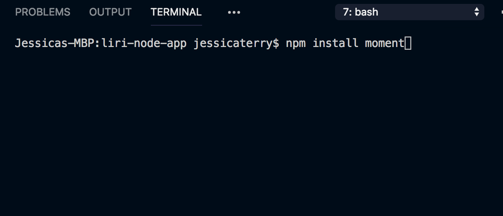
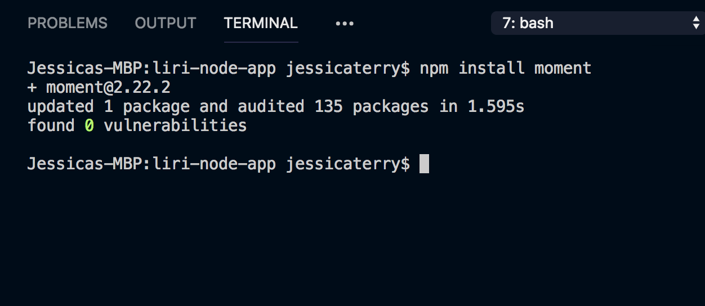
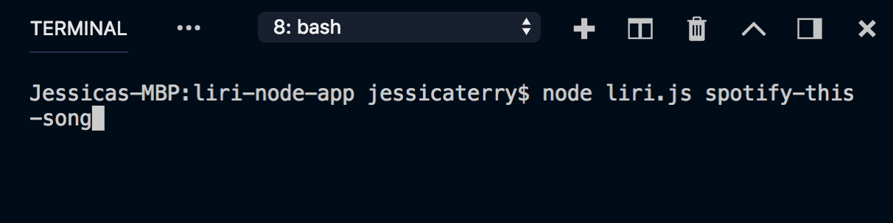
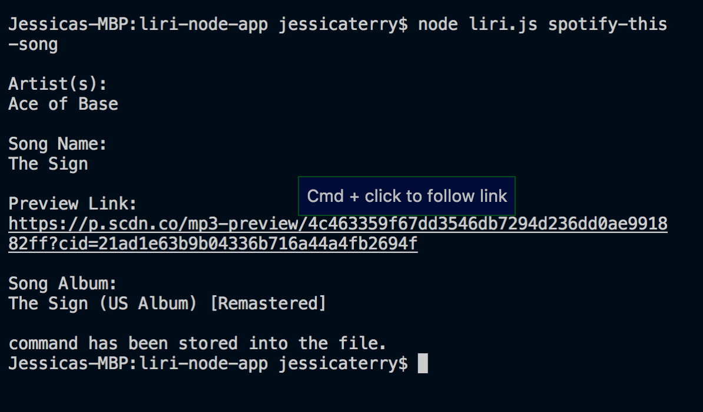
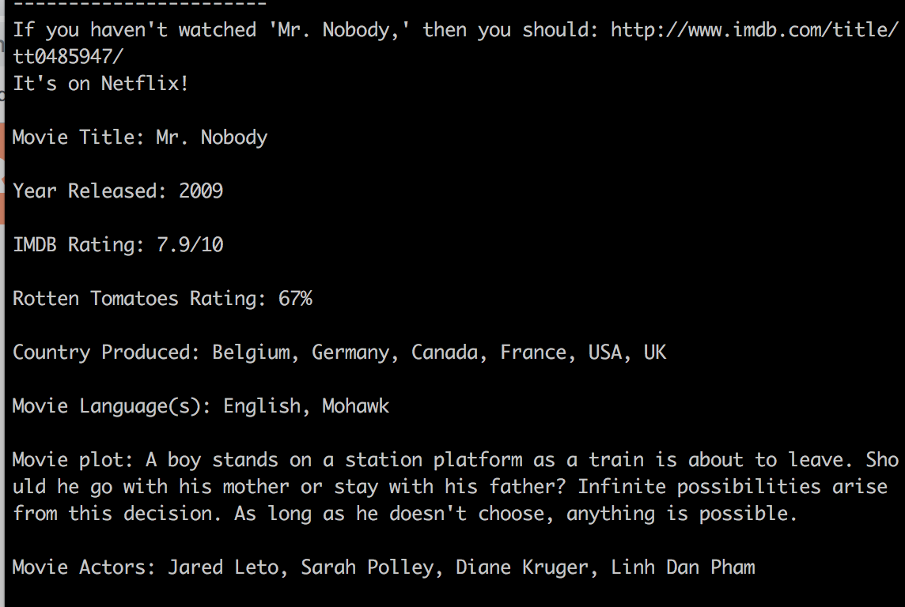
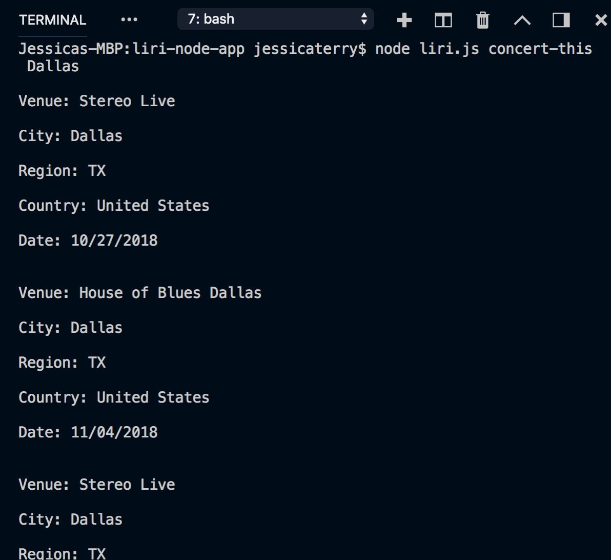
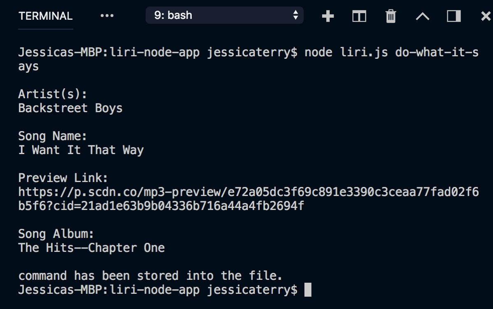

# Liri-Node-App

## Purpose

This is a CLI App that is a Language Interpretation and Recognition interface (LIRI) using Spotify, Bands in Town and OMDB API's. 

## Technologies Used

* Javascript
* Node
* API

# Before You Begin

You will be required to install a few things in order for this CLI App to work.

## 1. NPM Modules Required
 
 In your root directory folder in terminal please install these npm packages.





 ```
* [Node-Spotify-API](https://www.npmjs.com/package/node-spotify-api)
* [Request](https://www.npmjs.com/package/request)
* [Moment](https://www.npmjs.com/package/moment)
* [DotEnv](https://www.npmjs.com/package/dotenv)
```

## 2. (.env) File Setup

Next you will need to setup and create an .env file with your api keys for Spotify, Bands in Town, and OMDB. The file should be setup using the following format.

```
SPOTIFY_ID=*Your key goes here*
SPOTIFY_SECRET=*Your key goes here*

OMDB_ID=*Your key goes here*

BANDSINTOWN_ID=*Your key goes here*
```

## Use Liri

In the command line call Liri Using

```
node liri.js <command><argument>
```



## Liri Commands

```
* spotify-this-song
 
 An example of data from command and displayed
 

* movie-this

An example of data from command and displayed


* concert-this

An example of data from command and displayed


* do-what-it-says

An example of data from command and displayed


```

## Example Liri CLI Demo
[Liri Demo](screenshots/lirinodeexample.mp4)